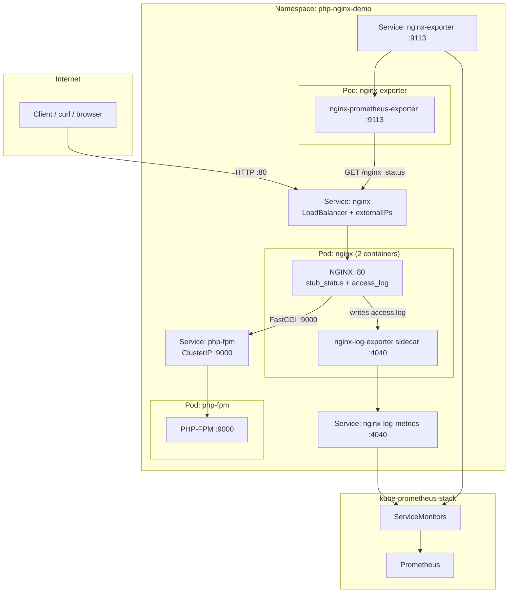
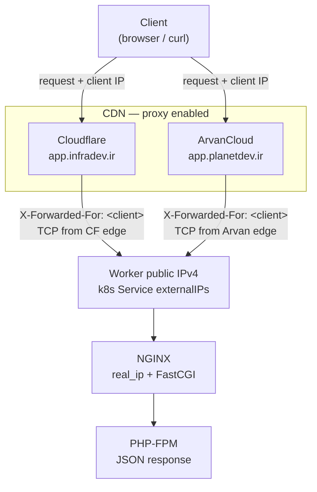

# PHP + NGINX on Kubernetes

A reference demo for running **PHP-FPM behind NGINX** on Kubernetes: real client IP detection, bare-metal-friendly exposure, and Prometheus metrics via two complementary NGINX exporters.

Designed to run on a small lab cluster (see [Infra](../Infra/) and [Observability](../Observability/)) alongside kube-prometheus-stack.

## What this project demonstrates

| Topic | Implementation |
|-------|----------------|
| Web stack | NGINX terminates HTTP, forwards PHP via FastCGI to PHP-FPM |
| Client IP | `X-Forwarded-For` + NGINX `real_ip` → JSON response from PHP |
| Exposure | `LoadBalancer` Service + `externalIPs`, or CDN proxy to worker IPv4 |
| Metrics | NGINX stub_status exporter + access-log exporter sidecar |
| Discovery | `ServiceMonitor` resources scraped by [kube-prometheus-stack](../Observability/) |

## Architecture



### Request path

1. Client sends HTTP to the NGINX Service (port 80).
2. NGINX serves static paths or rewrites to `index.php`.
3. PHP requests go to `php-fpm:9000` over FastCGI (ClusterIP Service).
4. NGINX applies `real_ip` from `X-Forwarded-For` and passes `REMOTE_ADDR` to PHP.
5. PHP returns JSON: `client_ip`, `remote_addr`, `x_forwarded_for`, `host`.

### Components

| Workload | Role | Port | Notes |
|----------|------|------|-------|
| `php-fpm` Deployment | Application runtime | 9000 | Not exposed outside the cluster |
| `nginx` Deployment | HTTP front door, FastCGI proxy | 80 | Config from ConfigMap |
| `nginx-log-exporter` | Sidecar in NGINX pod | 4040 | Reads shared access log volume |
| `nginx-exporter` Deployment | Stub status scraper | 9113 | HTTP client to `/nginx_status` |
| ServiceMonitors | Prometheus scrape config | — | See [Observability README](../Observability/README.md) |

## Design decisions

### Why NGINX and PHP-FPM are separate Deployments

- **Scale independently** — add PHP replicas without duplicating NGINX.
- **Clear boundaries** — web server config vs application code.
- **Standard pattern** — matches how most PHP shops run NGINX + PHP-FPM in production (different processes, connected over the network).

PHP-FPM is only reachable inside the cluster via the `php-fpm` Service. NGINX is the only public entry point.

### Why two metrics exporters (not one)

NGINX exposes **different signals** through **different mechanisms**:

| Exporter | Metrics source | Example metrics | Integration |
|----------|----------------|-----------------|-------------|
| **nginx-prometheus-exporter** | HTTP `stub_status` at `/nginx_status` | `nginx_up`, `nginx_connections_active`, total requests | Remote HTTP scrape |
| **nginx-log-exporter** (sidecar) | Access log file `/var/log/nginx/access.log` | `nginx_http_response_count_total{status="502"}` | Shared log volume |

`stub_status` alone does not expose HTTP status-code breakdown (2xx, 5xx). Access logs alone do not expose connection state. Both signal types are complementary for operations and alerting.

### Why the log exporter is a sidecar (same pod as NGINX)

The log exporter **tails a file** NGINX writes on disk. Both containers mount the same `emptyDir` volume at `/var/log/nginx`.

In Kubernetes, only containers in the **same pod** share that filesystem reliably. A separate pod cannot read another pod’s local log file without extra infrastructure (DaemonSet log agents, centralized logging, PVC shared across nodes, etc.).

**Rule of thumb:** file-based metrics → **sidecar pattern**.

### Why stub_status exporter is a separate pod

The official [nginx-prometheus-exporter](https://github.com/nginx/nginx-prometheus-exporter) only needs HTTP access to:

```text
http://nginx.php-nginx-demo.svc.cluster.local/nginx_status
```

No shared files are required. It could run as a third container in the NGINX pod, but a **separate Deployment** is valid and common because:

- It separates **connection/request counters** from the **traffic-serving pod**.
- It demonstrates **service-based scraping** (metrics client talks to a Kubernetes Service).
- It keeps the NGINX pod focused on serving HTTP and log-derived metrics.

**Rule of thumb:** HTTP-based scrapers → **sidecar or separate pod**; both are acceptable.

### Why `LoadBalancer` + `externalIPs`

On cloud providers, a `LoadBalancer` Service gets an external IP automatically. On bare-metal or VPS clusters (kubeadm, no MetalLB), `EXTERNAL-IP` often stays `<pending>`.

Setting `externalIPs` to the **worker node IP** (where NGINX pods run) exposes the app at `http://<worker-ip>/` without a cloud load balancer.

`externalTrafficPolicy: Local` preserves the client source IP path for debugging (with trade-offs on multi-replica setups).

### Why client IP is handled in NGINX, not only in PHP

Proxies and load balancers append the original client to `X-Forwarded-For`. NGINX:

1. Trusts configured proxy CIDRs (`set_real_ip_from` — demo uses `0.0.0.0/0`; production must narrow this).
2. Resolves the client IP with `real_ip_header` / `real_ip_recursive`.
3. Passes the result to PHP as `REMOTE_ADDR` via FastCGI.

PHP then reads `$_SERVER` and returns transparent JSON for verification.

### CDN and proxy path

The app is often exposed through a **CDN with proxy enabled**, not only via raw worker IP. DNS points at the CDN; the CDN forwards requests to the worker `externalIPs` address and sets `X-Forwarded-For`.



**Header flow:**

| Hop | What NGINX sees | Header |
|-----|-----------------|--------|
| Client → CDN | — | CDN records the client IP |
| CDN → origin (worker) | TCP peer = **CDN edge IP** | `X-Forwarded-For: <client IP>` |
| NGINX → PHP | `REMOTE_ADDR` after `real_ip` | `X-Forwarded-For` passed through |

**JSON field meanings (CDN setup):**

| Field | Typical value behind CDN |
|-------|--------------------------|
| `client_ip` | First address in `X-Forwarded-For` — the real client (or VPN exit) |
| `remote_addr` | CDN **edge** IP that opened the connection to the origin |
| `x_forwarded_for` | Raw header from the CDN (usually the client IP when proxy is on) |

#### Live examples

Two domains, same cluster origin (worker IPv4), different CDN providers:

| Domain | CDN | Proxy |
|--------|-----|-------|
| `app.infradev.ir` | Cloudflare | enabled |
| `app.planetdev.ir` | ArvanCloud | enabled |

**VPN enabled** (exit IP `91.247.177.168`):

```bash
curl app.infradev.ir
# client_ip:      91.247.177.168
# remote_addr:    162.158.159.164   ← Cloudflare edge
# x_forwarded_for: 91.247.177.168

curl app.planetdev.ir
# client_ip:      91.247.177.168
# remote_addr:    185.215.232.192   ← ArvanCloud edge
# x_forwarded_for: 91.247.177.168
```

**VPN disabled** (local ISP IP):

```bash
curl app.infradev.ir
# client_ip:      31.171.101.11
# remote_addr:    162.158.63.18     ← Cloudflare edge (different node)
# x_forwarded_for: 31.171.101.11

curl https://app.planetdev.ir
# client_ip:      151.238.79.58
# remote_addr:    94.101.182.11     ← ArvanCloud edge
# x_forwarded_for: 151.238.79.58
```

**What this shows:**

- `client_ip` tracks the **client (or VPN exit)** — changes when VPN toggles.
- `remote_addr` is always a **CDN edge** address, not the home ISP IP.
- Cloudflare and ArvanCloud use **different edge IP ranges** (`162.158.x` vs `185.215.x` / `94.101.x`).
- With regional routing or filtering, traffic may reach the CDN on **different network paths**; `X-Forwarded-For` reflects whichever client IP the CDN saw for that request.

Production should replace demo `set_real_ip_from 0.0.0.0/0` with [Cloudflare](https://www.cloudflare.com/ips/) and ArvanCloud published IP ranges only.

## Best practices

### Demo vs production

| Area | This demo | Production recommendation |
|------|-----------|---------------------------|
| `set_real_ip_from` | Trusts all (`0.0.0.0/0`) | Only trusted LB / ingress / CDN CIDRs |
| Grafana / default passwords | Documented defaults | Secrets, SSO, network policies |
| Single replica | 1 NGINX, 1 PHP-FPM | HPA, PDB, multiple replicas |
| Image tags | `:latest` | Immutable tags or digests |
| TLS | HTTP only | Ingress or LB with TLS termination |
| Metrics | Two exporters + ServiceMonitors | Same pattern; add alerts on 5xx rate |

### Kubernetes

- Set **resource requests and limits** on app pods (see [tuning-readme.md](tuning-readme.md)) so PHP-FPM gets predictable QoS on small nodes.
- Use **named ports** on metrics Services (`metrics`, `log-metrics`) — required for `ServiceMonitor` endpoints.
- Install [Observability](../Observability/) first so `ServiceMonitor` CRDs and Prometheus exist before applying app monitors.

### ServiceMonitor contract

Prometheus discovers monitors via `ServiceMonitor` resources. With this repo’s Observability `values.yaml`, **no special label** is required on the monitor itself.

Each metrics integration requires:

| Resource | Requirement |
|----------|-------------|
| **Service** | Labels matching `ServiceMonitor.spec.selector.matchLabels` |
| **Service port** | A **named** port matching `endpoints[].port` |
| **Metrics path** | Usually `/metrics` on the exporter |

| Exporter | Service selector labels | Port name |
|----------|-------------------------|-----------|
| stub_status | `app: nginx-exporter` | `metrics` |
| access log | `app: nginx`, `metrics: log` | `log-metrics` |

Full details: [Observability/README.md](../Observability/README.md).

### Useful PromQL

5xx rate from access-log metrics:

```promql
sum(rate(nginx_http_response_count_total{status=~"5.."}[5m]))
```

## Repository layout

```
App/
├── app/
│   ├── php-fpm/           # Dockerfile + index.php
│   └── nginx/             # Dockerfile + default.conf (image build reference)
├── k8s/                   # Kubernetes manifests (apply in order 00–11)
├── steps/
│   └── README.md          # Step-by-step build and deploy guide
├── tuning-readme.md       # PHP-FPM, NGINX, and cluster sizing
└── README.md              # This file — architecture and decisions
```

## Prerequisites

- A Kubernetes cluster ([Infra](../Infra/) README)
- `kubectl` and Helm configured
- [Observability stack](../Observability/) installed (for metrics)
- Docker (for building images)

## Get started

Follow the consolidated guide: **[steps/README.md](steps/README.md)**

Quick deploy (after images are built and pushed):

```bash
kubectl apply -f k8s/
kubectl get svc nginx -n php-nginx-demo
curl http://<worker-ip>/    # set externalIPs in k8s/05-nginx-service.yaml
```

## Tuning

On a **2 CPU / 5 GiB** worker shared with kube-prometheus-stack, PHP-FPM pool size and pod limits matter. See **[tuning-readme.md](tuning-readme.md)** for measurement-first guidance, formulas, and example resource patches.

## Related projects

| Directory | Purpose |
|-----------|---------|
| [Infra/](../Infra/) | Provision the Kubernetes cluster |
| [Observability/](../Observability/) | Install Prometheus, Grafana, and ServiceMonitor discovery |

## License

Part of the [forge](../) repository. Use and adapt freely; contributions welcome.
