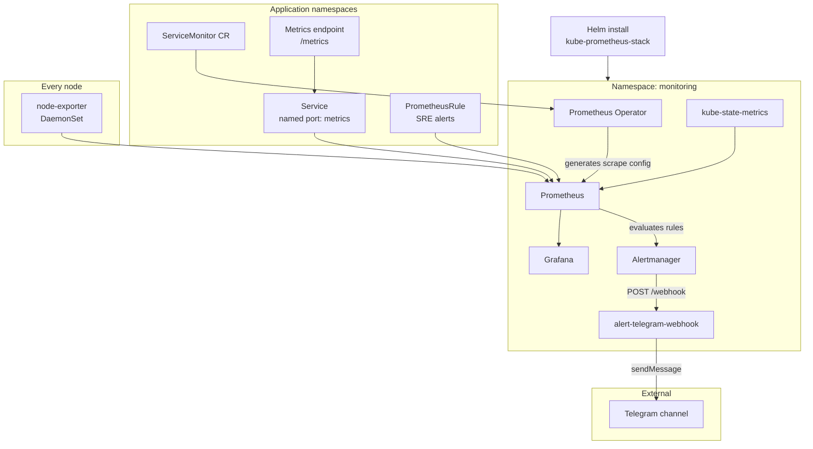

# Observability — kube-prometheus-stack

Install [kube-prometheus-stack](https://github.com/prometheus-community/helm-charts/tree/main/charts/kube-prometheus-stack) on a small Kubernetes cluster: Prometheus, Grafana, Alertmanager, node-exporter, kube-state-metrics, and the **Prometheus Operator** (including `ServiceMonitor` CRDs).

Helm values in this directory target lab-sized nodes (**2 CPU / 4 GiB RAM**) with explicit **resource requests and limits** so monitoring pods get predictable **QoS** and do not starve application workloads.

## What is included

| Component | Role |
|-----------|------|
| Prometheus Operator | Installs CRDs and generates Prometheus scrape config from `ServiceMonitor` / `PodMonitor` objects |
| Prometheus | Metrics storage and PromQL queries |
| node-exporter | DaemonSet — node CPU, memory, disk, and network metrics |
| kube-state-metrics | Metrics about Kubernetes objects (pods, deployments, nodes, …) |
| Alertmanager | Alert routing — `warning` / `critical` → Telegram webhook |
| Grafana | Dashboards (change the default admin password in `values.yaml`) |
| [WebhookApp](WebhookApp/) | Receives Alertmanager webhooks and posts to Telegram |

Chart version is pinned in [CHART_VERSION](CHART_VERSION). The chart is **vendored** under `charts/kube-prometheus-stack/` so installs work offline and stay reproducible.

## Architecture



### Metrics flow

1. **Helm** deploys the operator, Prometheus, Grafana, Alertmanager, node-exporter, and kube-state-metrics.
2. **Application teams** apply a `ServiceMonitor` that selects a metrics `Service` by label.
3. The **operator** watches `ServiceMonitor` CRs and updates Prometheus scrape targets — no manual `scrape_configs` edit.
4. **Prometheus** scrapes app endpoints, node-exporter, and kube-state-metrics; Grafana queries the same metrics store.
5. **PrometheusRule** objects (e.g. in `SRE/alerts/`) define alert conditions; firing alerts go to **Alertmanager**.
6. **Alertmanager** routes `warning` and `critical` alerts to [WebhookApp](WebhookApp/) (`POST /webhook`), which sends formatted messages to a **Telegram** channel.

Alert routing is configured in `values.yaml` under `alertmanager.config`. See [WebhookApp/README.md](WebhookApp/README.md) for deploy and test steps.

## Why one stack instead of separate tools?

A common alternative is to run **Prometheus alone** and maintain a long `scrape_configs` file by hand. On Kubernetes that becomes fragile: every new app or port change needs a config reload.

This repo uses **kube-prometheus-stack** plus **ServiceMonitor** resources because they solve different layers of the same problem:

| Layer | Tool | What it does |
|-------|------|----------------|
| Install & defaults | **kube-prometheus-stack** (Helm) | Deploys Prometheus, Grafana, Alertmanager, node-exporter, kube-state-metrics, and the operator in one maintained bundle |
| Scrape discovery | **Prometheus Operator** | Watches `ServiceMonitor` CRDs and **generates** Prometheus config automatically |
| Per-app contract | **ServiceMonitor** (YAML manifest) | Declares *which Service and port* to scrape — no Prometheus restart or Helm upgrade needed |

**ServiceMonitor is not a separate product** — it is a Kubernetes CRD installed by the operator. You write a small manifest in your app namespace; Prometheus picks it up.

Benefits for app teams:

- Add metrics by applying YAML next to your `Service`, not by editing a central Prometheus config.
- Same pattern for every app in the cluster.
- Works with GitOps (`kubectl apply`, Argo CD, etc.).

## Resource limits and QoS

`values.yaml` sets **CPU and memory requests and limits** on Prometheus, Grafana, Alertmanager, the operator, node-exporter, and kube-state-metrics.

On Kubernetes, requests and limits determine **Quality of Service (QoS)**:

| Pattern | QoS class | Effect |
|---------|-----------|--------|
| `requests` == `limits` | **Guaranteed** | Last to be evicted under memory pressure |
| `requests` < `limits` | **Burstable** | Can burst above request; evicted after BestEffort pods |
| No requests | **BestEffort** | First evicted when the node runs out of memory |

This stack uses **Burstable** or near-Guaranteed profiles so monitoring stays stable on a **2 CPU / 4 GiB** worker without consuming the whole node. Tune `values.yaml` if your cluster is larger or you disable Grafana / Alertmanager.

Rough memory budget (limits): Prometheus ~1 GiB, Grafana ~2 GiB (as configured), operator ~256 MiB, plus ~64 MiB per node for node-exporter.

## Prerequisites

- Kubernetes 1.25+ (recommended)
- `kubectl` configured for your cluster
- [Helm 3](https://helm.sh/docs/intro/install/)
- Optional: a StorageClass if you want persistent metrics (`values-pvc.yaml`). Default install uses `emptyDir` (metrics are lost if the Prometheus pod is recreated).

## Install

```bash
# From this directory (Observability/)

# 1. Create namespace
kubectl create namespace monitoring

# 2. Install from the upstream chart (version pinned in CHART_VERSION)
helm repo add prometheus-community https://prometheus-community.github.io/helm-charts
helm repo update prometheus-community
helm upgrade --install kube-prometheus-stack prometheus-community/kube-prometheus-stack \
  --namespace monitoring \
  --values values.yaml \
  --version 86.0.1 \
  --wait \
  --timeout 10m

# Optional — persist metrics across pod restarts (requires StorageClass):
# helm upgrade --install kube-prometheus-stack prometheus-community/kube-prometheus-stack \
#   --namespace monitoring \
#   --values values.yaml \
#   --values values-pvc.yaml \
#   --version 86.0.1 \
#   --wait \
#   --timeout 10m
```

Verify:

```bash
kubectl get pods -n monitoring
kubectl get crd | grep monitoring.coreos.com
kubectl get servicemonitor -A
```

<!-- Chart refresh (optional — chart is already vendored in this repo):
     ./scripts/pull-chart.sh
     or: helm pull prometheus-community/kube-prometheus-stack --version 86.0.1 --untar -d charts
-->

## Access UIs

**Grafana**

```bash
kubectl port-forward -n monitoring svc/kube-prometheus-stack-grafana 3000:80
```

Open http://localhost:3000 — user `admin`, password from `values.yaml` (`grafana.adminPassword`, default `changeme`).

### Import app dashboard

A pre-built dashboard for the [App](../App/) NGINX metrics lives at [`dashboards/php-nginx-demo.json`](dashboards/php-nginx-demo.json).

1. Port-forward Grafana (above).
2. **Dashboards → New → Import → Upload JSON file** — select `Observability/dashboards/php-nginx-demo.json`.
3. Select the Prometheus datasource → **Import**.

Panels use metrics from both exporters:

| Exporter | Metrics used |
|----------|----------------|
| nginx-prometheus-exporter | `nginx_up`, `nginx_http_requests_total`, `nginx_connections_*` |
| nginx-log-exporter | `nginx_http_response_count_total`, `nginx_http_response_time_seconds_hist_*`, `nginx_http_upstream_time_seconds_hist_*`, `nginx_http_response_size_bytes` |

**Response time panels** require `$request_time` and `$upstream_response_time` in the NGINX access log. The log line format must match **both**:

- `App/k8s/03-nginx-configmap.yaml` — `log_format prometheus` + `access_log ... prometheus`
- `App/k8s/09-nginx-log-exporter-configmap.yaml` — exporter `format:` string

After changing either file, apply and restart NGINX (new pod clears the shared log volume and drops old `combined` lines):

```bash
kubectl apply -f App/k8s/03-nginx-configmap.yaml
kubectl apply -f App/k8s/09-nginx-log-exporter-configmap.yaml
kubectl rollout restart deployment/nginx -n php-nginx-demo
```

Verify: `nginx_parse_errors_total` should stop increasing; `curl` the app and check `/metrics` on the log exporter for `nginx_http_response_count_total`, `nginx_http_response_time_seconds_hist_bucket`, and `nginx_http_upstream_time_seconds_hist_bucket`.

**Prometheus**

```bash
kubectl port-forward -n monitoring svc/kube-prometheus-stack-prometheus 9090:9090
```

Open http://localhost:9090 → **Status → Targets** to confirm scrapes are UP.

## ServiceMonitor — what Prometheus actually selects

This is the contract for **any app** (including the [forge App](../App/) demo) that exposes Prometheus metrics.

### 1. Labels on the ServiceMonitor itself

`values.yaml` configures Prometheus with **empty selectors**:

```yaml
serviceMonitorSelectorNilUsesHelmValues: false
serviceMonitorSelector: {}
serviceMonitorNamespaceSelector: {}
```

That means Prometheus discovers **every `ServiceMonitor` in every namespace**. You do **not** need a `release:` label (or any other label) on the `ServiceMonitor` metadata for this stack.

> **Note:** Stock `kube-prometheus-stack` defaults often require `release: <helm-release-name>` on each ServiceMonitor. This repo turns that off on purpose so app teams can ship monitors without coupling to the Helm release name.

The forge demo optionally adds `release: prometheus` on ServiceMonitors for documentation; it is **not required** with the selectors above.

### 2. Labels on your Service (required)

The `ServiceMonitor` does not scrape pods directly. It selects a **Service** via `spec.selector.matchLabels`. Those labels must exist on the Service (and match pod labels via the Service’s own `spec.selector`).

Example from the demo app:

| Resource | Label | Purpose |
|----------|-------|---------|
| Service | `app: nginx-exporter` | Identifies the metrics Service |
| ServiceMonitor `spec.selector.matchLabels` | `app: nginx-exporter` | Must match the Service labels above |

### 3. Named port on the Service (required)

`spec.endpoints[].port` must match a **port name** on the Service — not just a port number.

```yaml
# Service
ports:
  - name: metrics        # ← required name
    port: 9113
    targetPort: metrics

# ServiceMonitor
endpoints:
  - port: metrics          # ← must match the name above
    path: /metrics
    interval: 30s
```

### Minimal template

Copy [examples/servicemonitor.yaml](examples/servicemonitor.yaml) or use:

```yaml
apiVersion: monitoring.coreos.com/v1
kind: ServiceMonitor
metadata:
  name: my-app-metrics
  namespace: my-namespace
  # No special labels required with this repo's values.yaml
spec:
  selector:
    matchLabels:
      app: my-app          # must match your Service metadata.labels
  namespaceSelector:
    matchNames:
      - my-namespace
  endpoints:
    - port: metrics        # must match Service.spec.ports[].name
      path: /metrics
      interval: 30s
```

Apply:

```bash
kubectl apply -f examples/servicemonitor.yaml
# or your app's manifest, e.g. App/k8s/08-nginx-exporter-servicemonitor.yaml
```

### Checklist before debugging Prometheus

```bash
# Service exists with correct labels
kubectl get svc -n my-namespace -l app=my-app -o wide

# Endpoints are populated (pods behind the Service)
kubectl get endpoints -n my-namespace -l app=my-app

# ServiceMonitor exists
kubectl get servicemonitor -n my-namespace

# Prometheus is not filtering ServiceMonitors (should print {})
kubectl get prometheus -n monitoring -o jsonpath='{.items[0].spec.serviceMonitorSelector}{"\n"}'
```

In Prometheus UI → **Status → Targets**, look for a job like `my-namespace/my-app-metrics/0` with state **UP**.

### Demo app example

See [examples/nginx-exporter-servicemonitor.yaml](examples/nginx-exporter-servicemonitor.yaml) and the live manifests under [App/k8s/](../App/k8s/) (`08-nginx-exporter-servicemonitor.yaml`, `11-nginx-log-servicemonitor.yaml`).

Required demo labels and ports:

| Exporter | Service label | Port name |
|----------|---------------|-----------|
| nginx stub_status | `app: nginx-exporter` | `metrics` |
| nginx access-log metrics | `app: nginx-log-metrics` | `metrics` |

## Tune for your cluster

Edit `values.yaml`:

| Goal | Setting |
|------|---------|
| Less disk / RAM | Lower `prometheus.prometheusSpec.retention` and `retentionSize` |
| Smaller Prometheus | Reduce `prometheus.prometheusSpec.resources` (keep requests ≥ ~384 MiB for stability) |
| Stricter QoS | Set `requests` equal to `limits` on critical components |
| No Grafana | `grafana.enabled: false` |
| No alerts | `alertmanager.enabled: false` |
| Persist metrics | Install with `-f values-pvc.yaml` (needs StorageClass) |

Default install uses **emptyDir** for Prometheus — no PVC required; data is lost if the pod is recreated.

## Uninstall

```bash
helm uninstall kube-prometheus-stack -n monitoring
kubectl delete namespace monitoring
# CRDs remain unless removed manually:
# kubectl get crd -l app.kubernetes.io/part-of=kube-prometheus-stack
```

## Troubleshooting

| Problem | What to try |
|---------|-------------|
| Pending PVC | `kubectl get pvc -n monitoring`; fix StorageClass or use `storageSpec: {}` in `values.yaml` |
| OOM on worker | Lower Prometheus/Grafana limits or disable Grafana/Alertmanager |
| Master not scraped | node-exporter has tolerations for taints; etcd/scheduler rules are disabled in `values.yaml` |
| Target DOWN | Check Service port **name** is `metrics`; endpoints not empty; pod serves `/metrics` |
| Target missing | Confirm `serviceMonitorSelector` is `{}` (re-run `helm upgrade` with this repo’s `values.yaml`) |
| `nginx_parse_errors_total` rising | NGINX `access_log` format must match log-exporter `format:` — see [Import app dashboard](#import-app-dashboard) |
| Wrong Service selected | `ServiceMonitor.spec.selector.matchLabels` must match **Service** labels, not Deployment labels unless they are the same |

## Files

| File | Purpose |
|------|---------|
| `charts/kube-prometheus-stack/` | Vendored Helm chart |
| `CHART_VERSION` | Pinned chart version |
| `values.yaml` | Resources, QoS, and open ServiceMonitor selectors |
| `values-pvc.yaml` | Optional 10 GiB PVC for Prometheus |
| `examples/servicemonitor.yaml` | Generic ServiceMonitor + Service sample |
| `examples/nginx-exporter-servicemonitor.yaml` | Demo app stub_status exporter |
| `dashboards/php-nginx-demo.json` | Grafana dashboard for App NGINX metrics |
| `WebhookApp/` | Alertmanager → Telegram webhook service |
| `scripts/pull-chart.sh` | Optional script to refresh the vendored chart |

## License

Part of the [forge](../) repository. Use and adapt freely; contributions welcome.
