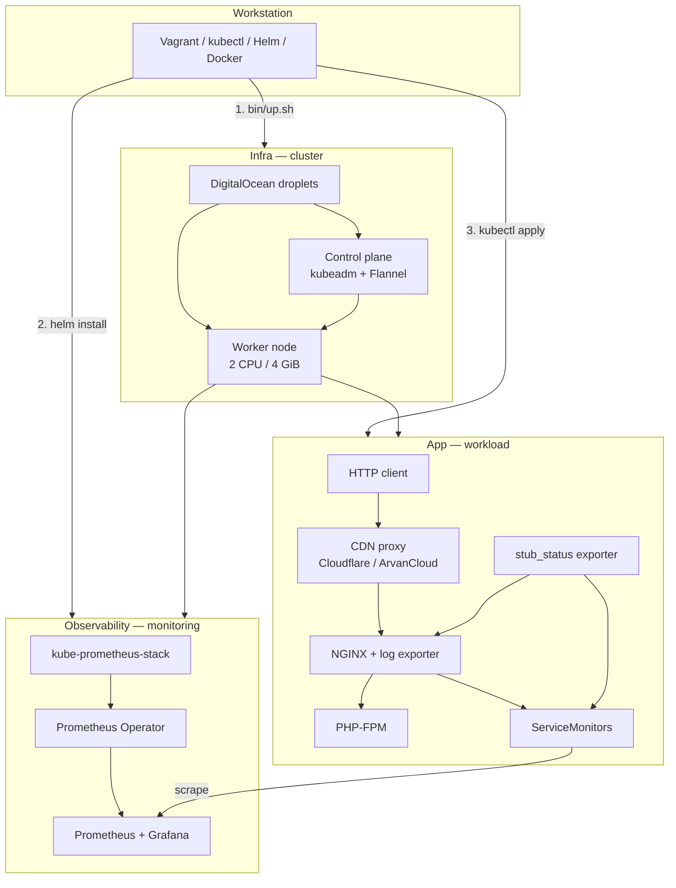

# forge

End-to-end Kubernetes lab: provision a cluster, install observability, deploy a PHP + NGINX application with Prometheus metrics.

Three standalone modules — each with its own README, manifests, and architecture diagram.

## Overview



## Recommended order

| Step | Module | Action |
|------|--------|--------|
| 1 | [Infra/](Infra/) | Provision Kubernetes on DigitalOcean (Vagrant + kubeadm) |
| 2 | [Observability/](Observability/) | Install Prometheus, Grafana, and ServiceMonitor CRDs |
| 3 | [App/](App/) | Build images, deploy PHP + NGINX, verify metrics |

## Project READMEs

| Directory | Contents |
|-----------|----------|
| **[Infra/README.md](Infra/README.md)** | Cluster provisioning, `.env` config, `kubectl` access, teardown |
| **[Observability/README.md](Observability/README.md)** | kube-prometheus-stack, QoS, ServiceMonitor contract |
| **[App/README.md](App/README.md)** | Application architecture, design decisions, monitoring rationale |
| **[App/steps/README.md](App/steps/README.md)** | Build images, deploy manifests, verify client IP and metrics |
| **[App/tuning-readme.md](App/tuning-readme.md)** | PHP-FPM, NGINX, and Kubernetes resource sizing |

## What each layer covers

| Layer | Topics |
|-------|--------|
| **Infra** | DigitalOcean droplets, kubeadm, containerd, Flannel, private VPC join, kubeconfig |
| **Observability** | Prometheus Operator, open ServiceMonitor selectors, resource limits / QoS |
| **App** | PHP-FPM + NGINX, client IP via `X-Forwarded-For`, CDN proxy to origin, dual exporters (log sidecar + stub_status pod) |

## Live demo (CDN)

The deployed app responds on CDN-fronted domains with JSON showing `client_ip`, `remote_addr`, and `x_forwarded_for` — useful for verifying proxy headers through Cloudflare and ArvanCloud.

See **[App/README.md — CDN and proxy path](App/README.md#cdn-and-proxy-path)** for architecture diagram, example `curl` output (VPN on/off), and field explanations.

## Quick links

```bash
# 1 — Cluster (from Infra/)
./bin/up.sh && ./bin/kubeconfig.sh

# 2 — Monitoring (from Observability/)
kubectl create namespace monitoring
helm upgrade --install kube-prometheus-stack ./charts/kube-prometheus-stack \
  -n monitoring -f values.yaml --wait

# 3 — Application (from App/, after images are built)
kubectl apply -f k8s/
```

Details, prerequisites, and troubleshooting live in each module README.

## License

Open source — use and adapt freely; contributions welcome.
