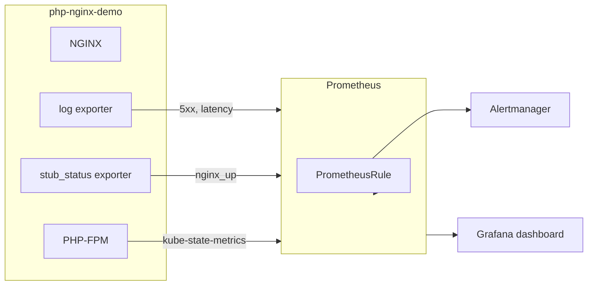

# SRE — failure simulation, alerts, and postmortems

Operational material for the **forge** lab stack: how to break things on purpose, what to alert on, and how to document incidents blamelessly.

Requires [Observability](../Observability/) (Prometheus + Alertmanager) and [App](../App/) deployed.

## Contents

| Path | Purpose |
|------|---------|
| [runbooks/simulate-failure.md](runbooks/simulate-failure.md) | Step-by-step failure injection |
| [alerts/php-nginx-demo-rules.yaml](alerts/php-nginx-demo-rules.yaml) | `PrometheusRule` alerts for NGINX / PHP-FPM |
| [postmortems/2026-05-31-php-fpm-unavailable.md](postmortems/2026-05-31-php-fpm-unavailable.md) | Example blameless postmortem (502 spike) |

## Alert strategy

### Goals

| Goal | How |
|------|-----|
| Detect user-visible failures | 5xx rate from access-log metrics |
| Detect broken monitoring path | `nginx_up`, log parse errors |
| Detect missing capacity | PHP-FPM deployment has zero ready replicas |
| Avoid alert fatigue | `for:` delays, warning vs critical severity |

### Severity model

| Severity | Meaning | Example alerts |
|----------|---------|----------------|
| **critical** | Service effectively down for clients | `NginxStubStatusDown`, `PhpFpmDeploymentNotReady` |
| **warning** | Degraded or rising error rate | `NginxHigh5xxRate`, `NginxLogParseErrors` |

### Signal sources



| Alert | Metric / source | Rationale |
|-------|-----------------|-----------|
| High 5xx rate | `nginx_http_response_count_total{status=~"5.."}` | Client-visible errors (502 when PHP-FPM is gone) |
| stub_status down | `nginx_up == 0` | NGINX metrics endpoint unreachable |
| Log parse errors | `nginx_parse_errors_total` increasing | Access log format drift — metrics silently wrong |
| PHP-FPM not ready | `kube_deployment_status_replicas_available` | Upstream capacity at zero before NGINX returns 502 |

### Deploy alert rules

```bash
kubectl apply -f SRE/alerts/php-nginx-demo-rules.yaml
```

Confirm Prometheus loaded the group:

```bash
kubectl get prometheusrules -n php-nginx-demo
# Prometheus UI → Status → Rules → php-nginx-demo
```

Alertmanager ships with kube-prometheus-stack but has **no notification receivers** by default. For a lab, verify alerts in the UI:

```bash
kubectl port-forward -n monitoring svc/kube-prometheus-stack-alertmanager 9093:9093
```

Open http://localhost:9093 — firing alerts appear under **Alerts**.

To route to Slack/email in production, add an `AlertmanagerConfig` or patch `alertmanager.config` in [Observability/values.yaml](../Observability/values.yaml).

### Useful PromQL (same as dashboard)

```promql
# 5xx rate
sum(rate(nginx_http_response_count_total{namespace="php-nginx-demo",status=~"5.."}[5m]))

# p95 upstream (PHP-FPM) latency
histogram_quantile(0.95, sum by (le) (rate(nginx_http_upstream_time_seconds_hist_bucket{namespace="php-nginx-demo"}[5m])))
```

Dashboard: [Observability/dashboards/php-nginx-demo.json](../Observability/dashboards/php-nginx-demo.json)

## Failure simulation (summary)

Full steps: [runbooks/simulate-failure.md](runbooks/simulate-failure.md)

**Recommended scenario for task part 4:** scale PHP-FPM to zero → NGINX returns **502** → alerts fire → restore → write postmortem.

```bash
# inject
kubectl scale deployment php-fpm -n php-nginx-demo --replicas=0
curl -i http://<worker-ip>/          # expect 502

# observe
kubectl port-forward -n monitoring svc/kube-prometheus-stack-prometheus 9090:9090
# Alerts → NginxHigh5xxRate, PhpFpmDeploymentNotReady

# restore
kubectl scale deployment php-fpm -n php-nginx-demo --replicas=1
```

Document the exercise using the [postmortem template](postmortems/2026-05-31-php-fpm-unavailable.md).

## Blameless postmortems

Postmortems in `postmortems/` follow these principles:

- Focus on **systems and process**, not individuals
- Separate **root cause** from **trigger** (e.g. scale to 0 was intentional; alert latency is the learning)
- Every action item is **owned** and **measurable**

## Related docs

- [App/README.md](../App/README.md) — architecture and CDN client IP behaviour
- [Observability/README.md](../Observability/README.md) — Prometheus stack and Grafana import
- [App/steps/README.md](../App/steps/README.md) — deploy and verify metrics
