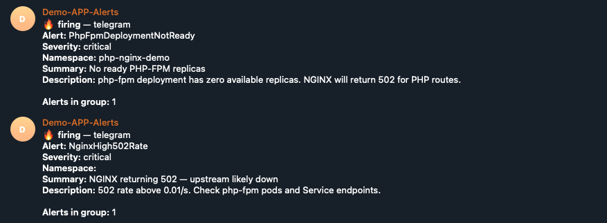

# Postmortem — PHP-FPM unavailable (502 spike)

| Field | Value |
|-------|-------|
| **Date** | 2026-06-01 |
| **Duration** | ~5 minutes (lab simulation) |
| **Severity** | SEV-2 (simulated) |
| **Author** | forge lab exercise |
| **Status** | Resolved |

## Summary

During a **planned failure simulation**, the `php-fpm` Deployment was scaled to **zero replicas**. NGINX continued to accept HTTP traffic but returned **502 Bad Gateway** for PHP routes because no upstream was available on `php-fpm:9000`. Prometheus alerts fired; the deployment was scaled back to one replica and service recovered.

This was **not** an unplanned production outage — it demonstrates observability and incident response for task.

## Impact

| Area | Effect |
|------|--------|
| **Users** | All requests to `/` returned 502 (simulated clients / curl) |
| **Scope** | `php-nginx-demo` namespace only |
| **Data loss** | None |
| **Monitoring** | 5xx counters and alerts behaved as designed |

## Timeline (UTC)

| Time | Event |
|------|-------|
| T+0 | `kubectl scale deployment php-fpm --replicas=0` (failure injected) |
| T+0 | `curl` to worker IP returns `502 Bad Gateway` |
| T+1m | `nginx_http_response_count_total{status="502"}` increases on log exporter |
| T+2m | Prometheus alert `NginxHigh5xxRate` → **firing** (`for: 2m`) |
| T+2m | Prometheus alert `PhpFpmDeploymentNotReady` → **firing** |
| T+2m | Prometheus alert `NginxHigh502Rate` → **firing** |
| T+2m | Alertmanager → webhook → **Telegram** notifications delivered (see below) |
| T+5m | `kubectl scale deployment php-fpm --replicas=1` (recovery) |
| T+6m | Pod ready; `curl` returns `200` JSON |
| T+8m | Alerts → **inactive** |

## Root cause

**Trigger:** intentional scale-to-zero of PHP-FPM (failure simulation).

**Mechanism:** NGINX proxies PHP to `php-fpm:9000` via ClusterIP. With no endpoints behind the Service, FastCGI connect fails → **502**.

**Why alerts worked:** access-log exporter exposes per-status counters; kube-state-metrics exposes deployment availability; `PrometheusRule` in `SRE/alerts/` evaluates 5xx rate and replica count. Alertmanager routes firing alerts to [WebhookApp](../../Observability/WebhookApp/), which posts to the **Demo-APP-Alerts** Telegram channel.

## Telegram notifications

On-call received three messages in Telegram within ~2 minutes of scaling PHP-FPM to zero:



**PhpFpmDeploymentNotReady** (critical)

```
🔥 firing — telegram
Alert: PhpFpmDeploymentNotReady
Severity: critical
Namespace: php-nginx-demo
Summary: No ready PHP-FPM replicas
Description: php-fpm deployment has zero available replicas. NGINX will return 502 for PHP routes.

Alerts in group: 1
```

**NginxHigh502Rate** (critical)

```
🔥 firing — telegram
Alert: NginxHigh502Rate
Severity: critical
Namespace:
Summary: NGINX returning 502 — upstream likely down
Description: 502 rate above 0.01/s. Check php-fpm pods and Service endpoints.

Alerts in group: 1
```

**NginxHigh5xxRate** (warning)

```
🔥 firing — telegram
Alert: NginxHigh5xxRate
Severity: warning
Namespace:
Summary: Elevated NGINX 5xx rate in php-nginx-demo
Description: More than 0.05 5xx responses per second over 5m (sustained 2m).
Common cause: PHP-FPM unavailable (502) or gateway timeout (504).

Alerts in group: 1
```

Resolved alerts were sent to the same channel after PHP-FPM was scaled back (`send_resolved: true` in Alertmanager config).

## What went well

- **502 visible in metrics** before checking logs (`nginx_http_response_count_total{status="502"}`)
- **Grafana dashboard** 5XX panel correlated with the event
- **Two complementary alerts** — application errors (5xx) and capacity (zero ready replicas)
- **Telegram notifications** — Alertmanager → webhook → channel; on-call saw firing alerts without opening Grafana
- **Fast recovery** — single `kubectl scale` command restored service
- **Blameless exercise** — no production users; clear inject / observe / recover steps

## What could be improved

| Gap | Risk in real production |
|-----|-------------------------|
| No automated runbook link in notification | Slower mean time to repair |
| No PodDisruptionBudget / min replicas | Accidental scale or drain could repeat |
| Bot token in ConfigMap (lab only) | Secret leakage if committed to git — use a Kubernetes Secret in production |

## Action items

| ID | Action | Owner | Priority | Status |
|----|--------|-------|----------|--------|
| A-1 | Add Alertmanager receiver (Telegram) via WebhookApp + `values.yaml` | platform | P2 | **Done** |
| A-2 | Set `php-fpm` **minReplicas: 1** if HPA is added later | app | P2 | Open |
| A-3 | Add optional `PodDisruptionBudget` for php-fpm | app | P3 | Open |
| A-4 | Document inject/recover in CI smoke test (optional) | sre | P3 | Open |

## Lessons learned

1. **502 is an upstream signal** — when NGINX serves but PHP-FPM does not, the fix is capacity/backend, not NGINX itself.
2. **Access-log metrics beat stub_status for 5xx** — `stub_status` shows total requests, not status-class breakdown.
3. **Alerts need a `for:` window** — avoids paging on single failed requests; 1–2 minutes is reasonable for this lab.
4. **Blameless culture** — the simulation proved the monitoring path; the “mistake” was intentional and documented.

## References

- Runbook: [../runbooks/simulate-failure.md](../runbooks/simulate-failure.md)
- Alerts: [../alerts/php-nginx-demo-rules.yaml](../alerts/php-nginx-demo-rules.yaml)
- Dashboard: [../../Observability/dashboards/php-nginx-demo.json](../../Observability/dashboards/php-nginx-demo.json)
- Webhook: [../../Observability/WebhookApp/](../../Observability/WebhookApp/)
